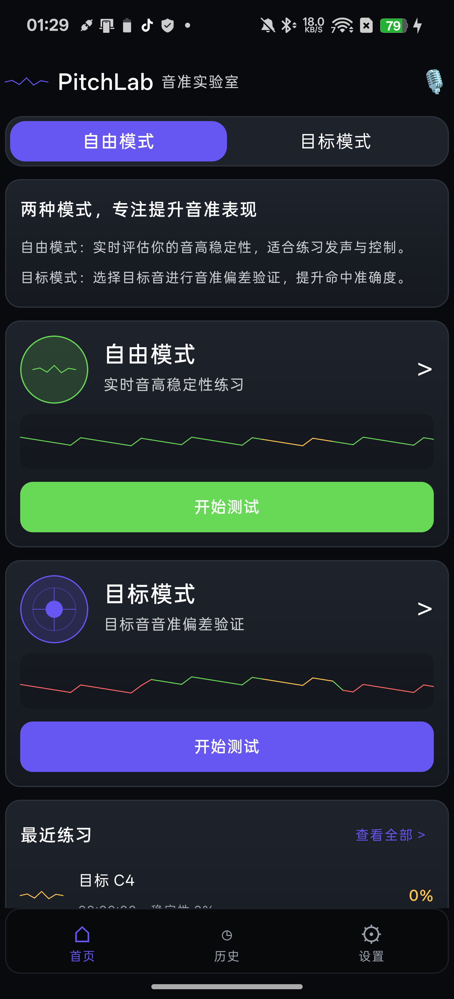
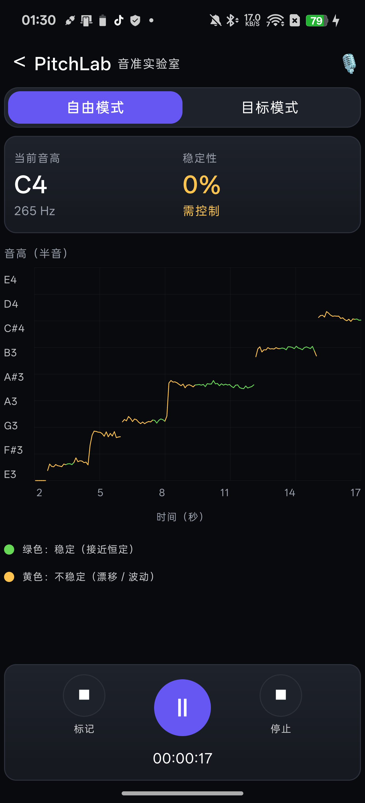
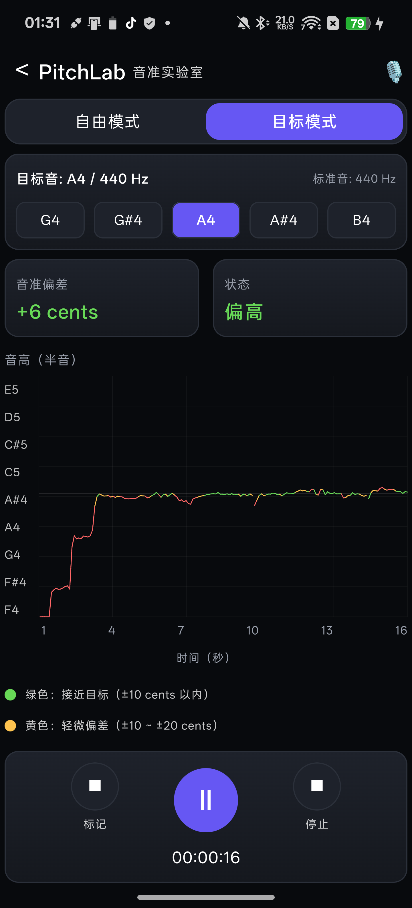
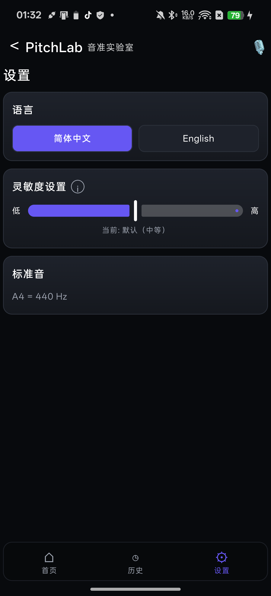

# PitchLab

PitchLab is a Kotlin Multiplatform + Compose Multiplatform app for pitch practice. It records live microphone input, detects the current pitch, draws a real-time pitch line, and helps acoustic learners judge pitch accuracy and stability.

The first production target is Android. iOS and Desktop currently keep the shared UI and simulated pitch input available for development.

## Features

- Free mode: practice pitch stability without a fixed target note.
- Target mode: choose a note and check whether the detected pitch is close enough.
- Instrument tuner: quickly tune standard guitar and ukulele strings, with per-string reference tones on Android.
- Real-time pitch chart with dynamic pitch range.
- Color feedback:
  - Green: stable or close to target.
  - Yellow: unstable or slightly off target.
  - Red: off target in target mode.
- Silence-aware timing: silent gaps do not extend the voiced-time counter or connect chart lines.
- Adjustable sensitivity for free-mode stability detection.
- Local practice history summaries.
- Simplified Chinese and English UI.
- Android microphone input through `AudioRecord`.

## Screenshots

| Home | Free Mode | Target Mode | Settings |
| --- | --- | --- | --- |
|  |  |  |  |

## Project Structure

```text
androidApp/   Android application entry point
desktopApp/   Desktop JVM entry point
iosApp/       iOS application shell
shared/       Shared Compose UI, pitch logic, models, and platform expect/actual code
```

## Tech Stack

- Kotlin Multiplatform
- Compose Multiplatform
- Android `AudioRecord`
- Shared YIN pitch detection implementation
- Gradle version catalogs

## Requirements

- JDK 17 or newer
- Android Studio with Kotlin Multiplatform support
- Android SDK 36
- Xcode for iOS builds on macOS

## Build and Run

Android debug build:

```bash
./gradlew :androidApp:assembleDebug
```

Windows:

```powershell
.\gradlew.bat :androidApp:assembleDebug
```

Desktop run:

```bash
./gradlew :desktopApp:run
```

iOS:

Open `iosApp/` in Xcode and run the iOS target.

## Tests

Run shared JVM tests:

```bash
./gradlew :shared:jvmTest
```

Run Android build plus shared tests:

```bash
./gradlew :shared:jvmTest :androidApp:assembleDebug
```

## Privacy

PitchLab processes microphone input locally for pitch detection. It does not save raw audio recordings. Practice history stores only summary data such as mode, target note, duration, stability, average deviation, and pass/fail state.

See [PRIVACY.md](PRIVACY.md) for details.

## Roadmap

- Improve target-note selector UX.
- Add real microphone support for iOS and Desktop.
- Add tuner screenshots and release builds.
- Add persistent settings for more training parameters.
- Add more pitch detection validation fixtures.

## Contributing

Contributions are welcome. Please read [CONTRIBUTING.md](CONTRIBUTING.md) before opening an issue or pull request.

## License

PitchLab is released under the [MIT License](LICENSE).
